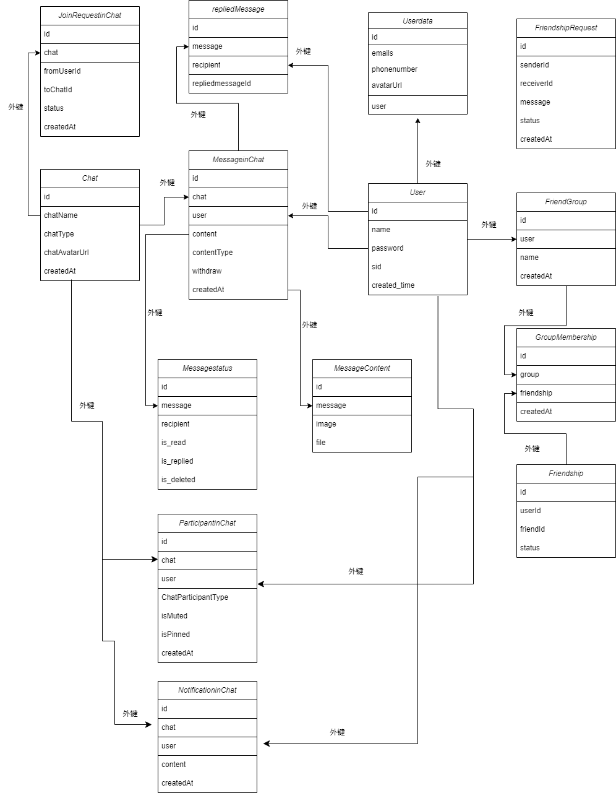

# Nexio 数据库文档

## 表的用途与表之间的关系

### 表的用途

- User: 用来存储用户与用户的基本信息,存有id(int),name(str),password(str),created_time(float),sid(str)

- Userdata: 用来存储用户数据, 存有id(int), user(User), emails(str), phonenumber(str), avatarUrl(file)

- Friendship: 用来存储好友关系, 存有id(int), userId(str), friendId(str), status(bool)

- FriendshipRequest: 用来存储好友请求, 存有id(int), senderId(str), receiverId(str), message(str), status(str), createdAt(float)

- FriendGroup: 用来存储好友分组, 存有id(int), user(User), name(str), createdAt(float)

- GroupMembership: 用来储存哪些好友在指定的组里, 存有id(int), group(FriendGroup), friendship(Friendship), createdAt(float)

- Chat: 用来储存某个聊天, 存有id(int), chatName(str), chatType(str), chatAvatarUrl(file), createdAt(float)

- MessageinChat: 用来存储聊天中的信息, 存有id(int), chat(Chat), user(User), content(str), contentType(str), createdAt(float), withdraw(bool)

- MessageStatus: 用来存储对于某个用户的某条消息的状态, 存有id(int), message(MessageinChat), recipient(User), is_read(bool), is_deleted(bool), is_replied(bool)

- MessageContent: 用来存储可能的多媒体消息内容, 存有id(int), message(MessageinChat), image(file), file(file)

- repliedMessage: 用来存储回复与被回复消息间的关系, 存有id(int), message(MessageinChat), recipient(User), repliedmessageid(str)

- ParticipantinChat: 用来存储在聊天中的用户,存有id(int), chat(Chat), user(User), ChatParticipantType(str), isMuted(bool), isPinned(bool), createdAt(float)

- NotificationinChat: 用来存储群公告, 存有id(int), chat(Chat), user(User), content(str), createdAt(float)

- JoinRequestinChat: 用来存储入群申请, 存有id(int), chat(Chat), fromUserId(str), toChatId(str), status(str), createdAt(float)

#### 表之间关系如图

